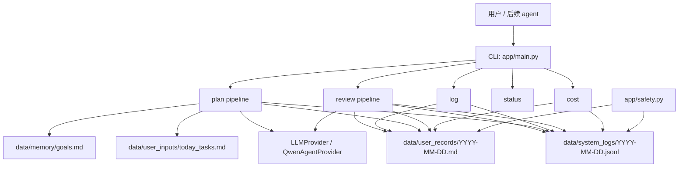

# 修身炉

修身炉是一个面向个人认知与执行管理的本地助手项目。当前版本已完成 Phase 1 的最小闭环：项目骨架、配置加载、Qwen Agent LLM Provider、事件日志、计划、记录、复盘、状态查看、token 统计和基础路径安全。

它可以作为一个程序员面试项目来讲：核心不是“做了一个聊天机器人”，而是展示如何把 LLM 能力放进一个本地优先、可追踪、可审计、可逐步授权的执行系统里。

第一阶段目标是先跑通最小闭环：

```text
记录 -> 计划 -> 复盘
```

当前还不是完整自主 agent，也不是自动化调度系统。它现在是一个可继续扩展的本地 Python CLI 执行闭环。

## 项目亮点

- **LLM Provider 抽象**：业务 pipeline 依赖 `LLMProvider.chat()`，当前实现是 Qwen Agent，后续可以替换其他模型。
- **固定 pipeline 优先**：先把计划、记录、复盘做成可解释流程，而不是一开始引入不可控 agent loop。
- **双层数据**：Markdown daily 给用户阅读，按日 JSON Lines events 给机器统计、审计和复盘。
- **安全边界**：用路径白名单限制文件读写，并保护长期目标文件不被普通流程改写。
- **数据隐私**：`data/` 下实际个人数据和运行数据不提交，只提交 example 模板和目录占位。
- **成本意识**：每次 LLM 调用记录 token usage，`cost` 命令本地统计并写入 daily。

## 当前能做到什么

- 使用独立 conda 环境 `xiushenlu` 运行项目。
- 从 `config/app.yaml` 读取模型、超时、重试次数、数据目录等配置。
- 通过 `DASHSCOPE_API_KEY` 连接 DashScope。
- 使用 `qwen_agent.agents.Assistant` 调用 Qwen 模型。
- 提供一个薄的 `LLMProvider.chat(prompt) -> str` 抽象，后续每日计划、晚间复盘 pipeline 可以复用。
- 运行 `python app/main.py`，向模型发送一句测试 prompt，并打印模型回复。
- 使用 `EventLogger.append_event(type, summary, detail=None)` 追加写入本地每日事件日志。
- 已有数据目录约定说明和长期目标模板。
- 使用 `read_goals()` 只读读取 `data/memory/goals.md`；该文件属于个人数据，不提交到版本库。
- 运行 `python app/main.py plan`，读取长期目标和今日待办，生成当天计划并写入 `data/user_records/YYYY-MM-DD.md`。
- 运行 `python app/main.py log "内容"`，向当天 daily 追加记录。
- 运行 `python app/main.py review`，根据当天 daily 和事件日志生成复盘；可加 `--date YYYY-MM-DD` 指定历史日期。
- 运行 `python app/main.py status`，查看当天 daily 内容。
- 运行 `python app/main.py cost`，查看今日和本月 LLM token 消耗，并把统计写入当天 daily 的记录区块。
- 使用路径白名单保护运行时文件读写，并阻止普通流程改写 `data/memory/goals.md`。
- 已建立 Phase 1 需要的数据目录：
  - `data/user_records/`
  - `data/user_inputs/`
  - `data/memory/`
  - `data/system_logs/`

## 当前还不能做什么

- 还没有定时调度。
- 还没有手机通知。
- 还没有 Web 控制台。

这些能力会在后续里程碑中逐步补齐。

## 架构概览



更详细的面试讲解、流程图和结构图见 `docs/执行/2026-04-19.md`。

## 环境

本项目使用 conda 环境：

```powershell
conda activate xiushenlu
```

如果以后需要从配置文件重建环境，可以参考：

```powershell
conda env create -f environment.yml
```

依赖清单也保留在 `requirements.txt`

## 配置

主配置文件是：

```text
config/app.yaml
```

当前默认模型：

```yaml
llm:
  provider: qwen_agent
  model: "qwen3-max-2026-01-23"
  timeout: 30
  retry_count: 2
  api_key_env: "DASHSCOPE_API_KEY"
```

需要确保环境变量 `DASHSCOPE_API_KEY` 可用。也可以在项目根目录放 `.env` 文件，由 `python-dotenv` 自动加载。

## 运行

在项目根目录执行：

```powershell
conda activate xiushenlu
python app/main.py
```

成功时会看到模型返回一句确认连通的回复。

生成今日计划：

```powershell
conda activate xiushenlu
python app/main.py plan
```

计划命令会读取：

- `data/memory/goals.md`：长期目标，只读输入。
- `data/user_inputs/today_tasks.md`：今日待办，可由用户或 agent 更新。

`data/user_inputs/` 是当天输入篮子，用来放临时材料、今日待办、待总结片段和后续 agent 准备处理的材料。`today_tasks.md` 是当天计划最直接的任务来源；如果使用 `python app/main.py plan --tasks "..."`，传入内容会同步写回 `data/user_inputs/today_tasks.md`，后续 agent 也可以用这个入口更新当天待办。

`data/` 下的实际个人数据和运行数据默认不提交到版本库；可提交的是 `*.example.md` 模板、目录占位文件和说明文档。

输出会写入：

- `data/user_records/YYYY-MM-DD.md`
- `data/system_logs/YYYY-MM-DD.jsonl`

添加今日记录：

```powershell
python app/main.py log "今天完成了一个关键任务"
```

生成晚间复盘：

```powershell
python app/main.py review
python app/main.py review --date 2026-04-27  # 指定历史日期
```

查看今日状态：

```powershell
python app/main.py status
```

查看 token 消耗：

```powershell
python app/main.py cost
```

该命令会打印 token 统计，并把同一份统计追加到当天 daily 的 `记录` 区块。当前优先统计 token，不做费用估算。

`cost` 不调用 LLM，只读取本地 `data/system_logs/YYYY-MM-DD.jsonl` 中的 `llm_call` 事件。

## 当前目录结构

```text
xiushenlu/
  app/
    main.py
    config.py
    daily.py
    inbox.py
    logger.py
    safety.py
    cost.py
    llm/
      provider.py
      qwen_agent_impl.py
    pipelines/
      daily_plan.py
      nightly_review.py
  config/
    app.yaml
  data/
    user_records/
    user_inputs/
    memory/
    system_logs/
    state/
    quarantine/
  docs/
    规划/
    吸纳/
    执行/
  llm/
  environment.yml
  requirements.txt
  README.md
  AGENTS.md
```

## 文档

项目文档已按用途整理：

- `docs/规划/`：目标、路线图、能力批次和实施边界。
- `docs/吸纳/`：外部产品、框架和方案的调研吸收。
- `docs/执行/`：按日期记录每天实际完成的事。

当前面试向项目总结：

- `docs/执行/2026-04-19.md`

## 下一步

按照 `docs/规划/2026-04-16_修身炉规划.md`，Phase 1 的能力批次已经完成。下一步进入后续里程碑：

- 自动化与通知：定时运行计划/复盘，并通过 PushPlus / PushDeer 推送。
- 本地控制台：查看状态、日志、计划和复盘。
- 更完整的安全与审批：工具注册、审批队列、异常暂停。
